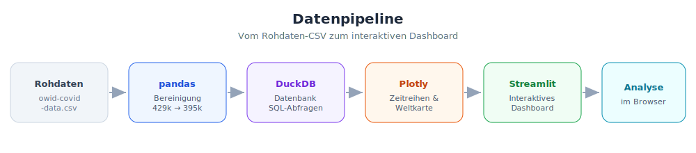
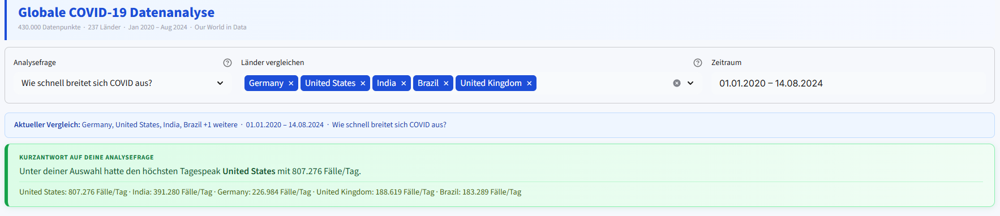
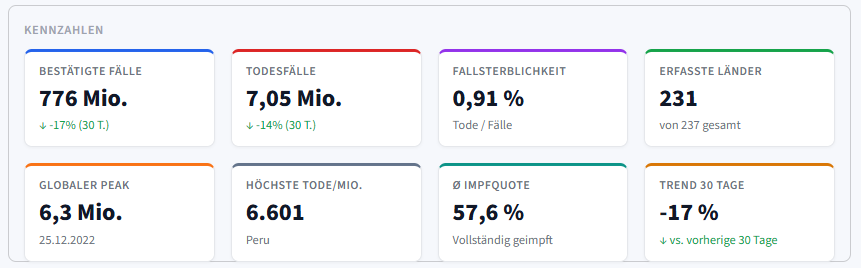
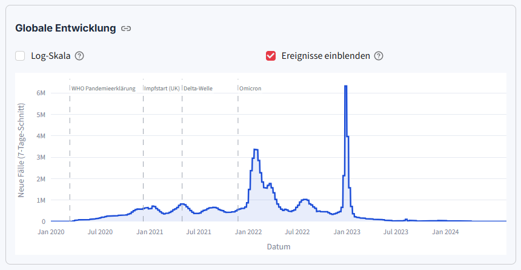
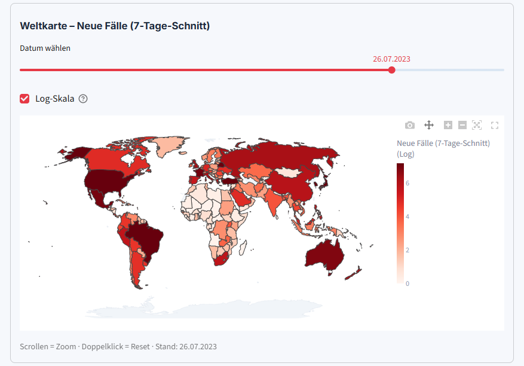
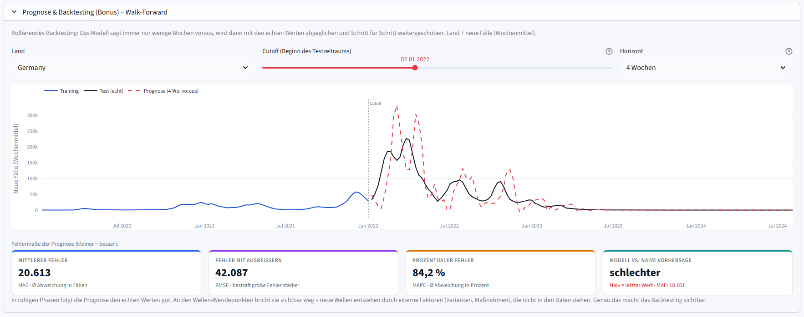

# 🦠 Globale COVID-19 Datenanalyse

Ein interaktives Dashboard zur **Aufbereitung und Visualisierung globaler COVID-19-Daten**
aus dem [Our World in Data](https://github.com/owid/covid-19-data)-Datensatz – mit Schwerpunkt
auf **Zeitreihenanalyse** und **geographischer Visualisierung**.

> Modulprojekt *Datenaufbereitung und Verarbeitung* · Python · Pandas · DuckDB · Plotly · Streamlit

---

## 💡 Die Idee dahinter

Der OWID-Rohdatensatz umfasst **rund 430.000 Zeilen aus 237 Ländern** über viereinhalb Jahre.
Er ist umfassend – aber **unsauber und unübersichtlich**: aggregierte Einträge wie „World"
verfälschen Summen, Meldelücken am Wochenende reißen Kurven auseinander, Werte liegen in völlig
unterschiedlichen Größenordnungen.

**Die Leitfrage:** Wie verwandelt man diese Rohdaten in eine verständliche, interaktive Analyse?

Die Antwort ist eine vollständige Pipeline – vom CSV bis zum Dashboard:



---

## 📸 Das Dashboard

### Titel & Filterleiste
Gesteuert wird über **Analysefragen** statt technischer Feldnamen – darunter eine automatische,
datenbasierte Kurzantwort zur gewählten Frage.


### Kennzahlen & Key Insights
Die wichtigsten Werte auf einen Blick – inklusive Trend der letzten 30 Tage und globalem Peak.


### Zeitreihen mit Pandemie-Ereignissen
Globale Entwicklung mit einblendbaren Ereignissen (WHO-Pandemieerklärung, Impfstart, Delta, Omicron).


### Geographische Weltkarte mit Datum-Slider
Choropleth-Karte – der Slider zeigt die globale Ausbreitung über die Zeit.


### Prognose & Backtesting (Bonus)
Walk-Forward-Backtesting mit Holt-Winters-Modell und Fehlermaßen.


---

## ✨ Funktionen

| Funktion | Beschreibung |
|---|---|
| **Analysefragen** | Steuerung über Fragestellungen statt technischer Feldnamen (z. B. „Welche Länder waren am stärksten betroffen?") |
| **Automatische Kurzantwort** | Zu jeder Frage eine datenbasierte Antwort, bezogen auf die gewählten Länder |
| **Kennzahlen & Insights** | Fälle, Tode, Fallsterblichkeit, Trend der letzten 30 Tage, globaler Peak u. v. m. |
| **Zeitreihen** | Globale Entwicklung, Länder- und Kontinentvergleich, Log-Skala, einblendbare Ereignisse (WHO, Impfstart, Delta, Omicron) |
| **Weltkarte** | Choropleth-Karte mit Datum-Slider zur Verfolgung der globalen Ausbreitung |
| **Impfkampagne** | Impffortschritt im Ländervergleich |
| **Prognose (Bonus)** | Walk-Forward-Backtesting mit Holt-Winters-Modell inkl. Fehlermaßen |

---

## 🧹 Datenaufbereitung – mit Beispielen

Der spannendste Teil: aus unsauberen Rohdaten saubere Daten machen. Vier konkrete Probleme
und ihre Lösung (umgesetzt in [`data_prep.py`](data_prep.py)):

### 1. Aggregate sind keine Länder
Der Datensatz enthält neben echten Ländern auch Summen wie `World` oder `High-income countries`:

| iso_code | location |
|---|---|
| `OWID_WRL` | World |
| `OWID_HIC` | High-income countries |
| `OWID_EUR` | Europe |

→ **Lösung:** Echte Länder haben einen ISO-Code aus genau drei Großbuchstaben (`DEU`, `USA`).
Ein regulärer Ausdruck filtert die Aggregate heraus – von **429.000 auf 395.000 Zeilen**.

```python
real_countries = df['iso_code'].str.match(r'^[A-Z]{3}$', na=False)
```

### 2. Wochenend-Lücken bei kumulierten Werten
Deutschland meldete 2023 oft nur einmal pro Woche – die Gesamtzahl darf dazwischen aber nicht
auf 0 fallen:

| date | new_cases | total_cases |
|---|---|---|
| 2023-06-04 | 2.767 | 38.430.723 |
| 2023-06-05 | 0 | *(leer)* → 38.430.723 |
| 2023-06-11 | 2.392 | 38.433.115 |

→ **Lösung:** Forward Fill pro Land – der letzte bekannte Wert wird weitergezogen.

```python
df[col] = df.groupby('location')[col].ffill().fillna(0)
```

### 3. Negative Tageswerte
Durch nachträgliche Korrekturen meldeten Länder gelegentlich negative Fallzahlen – für ein
Diagramm sinnlos. → **Lösung:** auf 0 setzen (`clip(lower=0)`).

### 4. Zu viele Spalten
Von **67 Spalten** behalten wir nur **21 relevante** – der Rest ist für Zeitreihen und
Geographie irrelevant oder zu lückenhaft (z. B. Test- und Krankenhausdaten bei >70 % fehlend).

---

## 🛠️ Technologie-Stack

| Bereich | Werkzeug | Warum |
|---|---|---|
| Datenaufbereitung | **pandas** | Standard für Datenbereinigung in Python |
| Datenhaltung | **DuckDB** | Schnelle SQL-Abfragen, läuft in-process ohne Server |
| Visualisierung | **Plotly** | Interaktive, zoombare Diagramme und Karten |
| Dashboard | **Streamlit** | Schnell entwickelbares Web-Dashboard ohne Frontend-Code |
| Prognose | **statsmodels** | Holt-Winters-Zeitreihenmodell |

---

## 📂 Projektstruktur

```
covid_dashboard/
├── app.py             # Streamlit-Dashboard (Hauptdatei)
├── data_prep.py       # Datenbereinigung + Aufbau der DuckDB-Datenbank
├── queries.py         # SQL-Abfragen gegen DuckDB
├── requirements.txt   # Python-Abhängigkeiten
├── images/            # Diagramm & Screenshots
└── README.md
```

> `covid.duckdb` und die Rohdaten-CSV sind **nicht** im Repo enthalten – die Datenbank wird
> lokal erzeugt, die CSV ist mit ~94 MB zu groß für GitHub (siehe Installation).

---

## 🚀 Installation & Start

```bash
# 1. Repository klonen
git clone https://github.com/FinnGIG/covid-dashboard.git
cd covid-dashboard

# 2. Abhängigkeiten installieren
pip install -r requirements.txt

# 3. Datensatz herunterladen (~94 MB)
#    von https://github.com/owid/covid-19-data/tree/master/public/data
#    die Datei "owid-covid-data.csv" in den Projektordner legen

# 4. Datenbank aufbauen (erzeugt covid.duckdb)
python data_prep.py

# 5. Dashboard starten
streamlit run app.py
```

Das Dashboard öffnet sich automatisch unter `http://localhost:8501`.

---

## 🤔 Grenzen & kritische Reflexion

- **Meldeverzögerungen** (v. a. Wochenenden) und unterschiedliche Teststrategien je Land machen
  globale Vergleiche unsicher – die Log-Skala hilft, verzerrt aber die Interpretation.
- **Test- und Krankenhausdaten** wurden bewusst ausgeklammert, da sie fast nur für reiche
  Länder vorliegen und sonst eine verzerrte „globale" Aussage entstünde.
- Die **Prognose** ist ein ehrlicher Bonus: Klassische Modelle funktionieren in ruhigen Phasen,
  **versagen aber an Wellen-Wendepunkten** – diese werden durch externe Faktoren (neue Varianten,
  Maßnahmen) ausgelöst, die nicht in den historischen Daten stehen. Genau das macht das
  Walk-Forward-Backtesting sichtbar.

---

## 📊 Datenquelle

[Our World in Data – COVID-19 Dataset](https://github.com/owid/covid-19-data) · Lizenz: CC BY 4.0
